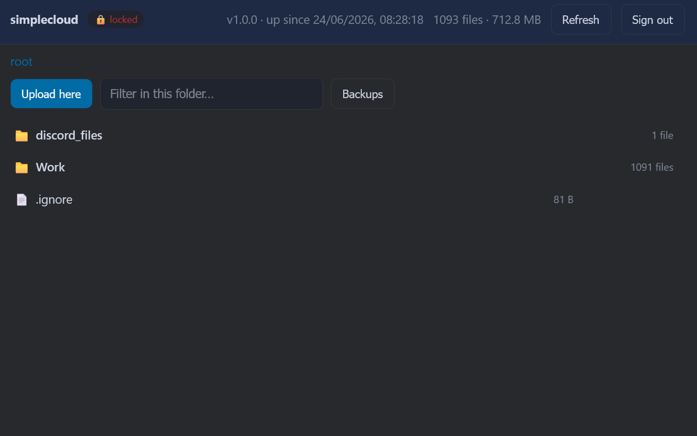

# simple-cloud

Self-hosted cloud file-storage. Node.js server on a Linux VPS, Node.js client on Windows or Linux, with an optional web UI with 2FA and Discord bot.



## How it's different from Seafile / Nextcloud

- **Simpler to run.** No Docker, no separate database, just Node.js and npm under PM2. The whole server is a small Fastify app. (`better-sqlite3` for embedded SQLite and the `7z` system package for the locked folder are the only non-JS pieces, both handled by the installer.)
- **Multiple access methods, each secured properly.** Desktop sync clients and the Discord bot authenticate with HMAC-signed requests — the signing key never travels on the wire. The web UI has a separate login, password + TOTP 2FA (on by default), HttpOnly session cookies, rate limiting, and CSRF protection. Each interface is disabled by default.
- **Built-in versioning and recycle bin.** Every overwrite keeps the old version; deletions go to a dated recycle bin. Both are restorable from any client and expire on a schedule.

## Repository layout

```text
simple-cloud/
├── server/   ← Fastify server (runs on Linux VPS)
└── client/   ← Sync client (Windows + Linux)
```

## Server setup (Linux)

### Prerequisites

- Node.js 20 LTS
- nginx (or another reverse proxy) with SSL — **required**; see the section below

### One-line install

SSH into your VPS and run:

```bash
curl -fsSL https://raw.githubusercontent.com/tabahi/simple-cloud/refs/heads/main/server/setup.sh | sudo bash
```

The wizard asks for:

1. **Port**: localhost port Fastify listens on (default `11277`)
2. **Storage directory**: where uploaded files are stored (default `/var/simplecloud/storage`)
3. **SSL**: whether to enable direct TLS; auto-detects Let's Encrypt certs under `/etc/letsencrypt/live/`
4. **PM2 process name** (default `simplecloud-server`)

When done it will:

- Write `server/config/server.json`
- Create all required directories
- Run `npm install`
- Generate a random auth token at `server/config/token.txt`
- Install PM2 (if absent) and start the server
- Print the **auth token** and next steps

**Copy the token**, every client needs it.

### Reverse proxy (nginx) — required

> **Without a TLS-terminating reverse proxy, all file content travels in plaintext over the network.** The signing key itself is never sent on the wire (requests use HMAC signatures), but without SSL anyone who can observe traffic can read and tamper with the files being synced. Set nginx up before connecting any client.

Fastify binds to `127.0.0.1` only and is never exposed directly. nginx listens on the public port, terminates SSL, and forwards requests to Fastify on localhost.

A ready-to-use config is at [`server/simplecloud.nginx`](server/simplecloud.nginx). Copy it to `/etc/nginx/sites-enabled/simplecloud`, replace `myexamplewebsite.com` with your domain and update the cert paths, then:

```bash
sudo nginx -t && sudo systemctl reload nginx
```

### Uninstall

```bash
curl -fsSL https://raw.githubusercontent.com/tabahi/simple-cloud/refs/heads/main/server/setup.sh | sudo bash -s -- --uninstall
```

Or if you already have the repo on the VPS:

```bash
sudo bash /opt/scserver/server/setup.sh --uninstall
```

Stops the PM2 process and optionally removes data directories and source files.

### Useful PM2 commands

```bash
pm2 logs simplecloud-server        # tail live logs
pm2 restart simplecloud-server     # restart after a code change
pm2 stop simplecloud-server        # stop
pm2 delete simplecloud-server      # remove from PM2 entirely
```

### Manual run (without PM2)

```bash
pm2 stop simplecloud-server
node /opt/scserver/server/src/index.js
```

### Get the token later

```bash
cat /opt/scserver/server/config/token.txt
```

## Client setup

See **[client/README.md](client/README.md)** for full setup instructions.

**Windows**: install [Node.js 20 LTS](https://nodejs.org/), open PowerShell, and run:

```powershell
Set-ExecutionPolicy -Scope Process -ExecutionPolicy Bypass
irm https://raw.githubusercontent.com/tabahi/simple-cloud/refs/heads/main/client/setup.ps1 | iex
```

Downloads the client, installs dependencies, and runs a setup wizard that asks for the server URL and token. Auto-start on login is set up automatically.

**Linux:**

```bash
cd client
npm install
node src/index.js   # creates ~/.config/simplecloud/.env then exits
# fill in SC_SERVER_URL and SC_TOKEN, then run again
node src/index.js
```

Use systemd for auto-start on Linux (see [client/README.md](client/README.md#auto-start-on-linux-systemd)).

## Server configuration

All server-side config lives in **`server/.env`**. The setup wizard writes it; you can also copy [`server/.env.example`](server/.env.example) to `server/.env` and edit by hand. Run `pm2 restart simplecloud-server` after any change.

`.env` is **gitignored**, paths, cert locations, and secrets never get committed. Only `.env.example` is tracked. Environment variables already set in the process override values in `.env`.

```bash
SC_PORT=11277
SC_HOST=127.0.0.1

SC_STORAGE_DIR=/home/simplecloudstorage/data
SC_TEMP_DIR=/home/simplecloudstorage/temp
SC_LOG_DIR=/var/simplecloud/logs
SC_DB_DIR=/var/simplecloud
SC_FILECHANGE_LOGS=          # empty → <SC_LOG_DIR>/changes.log

SC_PM2_NAME=simplecloud-server
SC_BACKUP_RETENTION_DAYS=90
SC_BACKUP_MAX_FILE_SIZE_BYTES=10485760

SC_LOCKED_FOLDER_NAME=.simplecloud_locked
SC_LOCKED_ZIP=/home/simplecloudstorage/locked.7z

SC_SSL_ENABLED=false
SC_SSL_CERT_FILE=/etc/letsencrypt/live/example.com/fullchain.pem
SC_SSL_KEY_FILE=/etc/letsencrypt/live/example.com/privkey.pem

SC_DISCORD_ENABLED=false
SC_DISCORD_TOKEN=
SC_DISCORD_CLIENT_ID=
SC_DISCORD_GUILD_ID=
SC_DISCORD_ALLOWED_USER_IDS=      # comma-separated
SC_DISCORD_ALLOWED_CHANNEL_IDS=   # comma-separated
SC_DISCORD_MAX_UPLOAD_BYTES=26214400

SC_WEB_ENABLED=false              # optional browser UI (see Web UI section)
SC_WEB_TOTP_ENABLED=true          # 2FA on by default
# SC_WEB_PASSWORD_HASH / SC_WEB_SESSION_SECRET / SC_WEB_TOTP_SECRET are written by setup.sh
SC_WEB_SESSION_TTL_MINUTES=60
```

| Variable | Description |
| --- | --- |
| `SC_PORT` | Port Fastify listens on,  nginx proxies to this |
| `SC_HOST` | Bind address,  localhost only, nginx handles external traffic |
| `SC_STORAGE_DIR` | Live file blobs (flat, UUID filenames) |
| `SC_LOCKED_FOLDER_NAME` | Secure folder name prefix. Clients pick it up automatically via `/api/lock-status` |
| `SC_LOCKED_ZIP` | Where the encrypted 7z archive goes when the folder is locked |
| `SC_TEMP_DIR` | Pre-overwrite backups, grouped by date |
| `SC_FILECHANGE_LOGS` | Append-only JSON change log. Empty → `<SC_LOG_DIR>/changes.log` |
| `SC_LOG_DIR` | Pino rolling log files |
| `SC_DB_DIR` | SQLite database (`simplecloud.db`) |
| `SC_PM2_NAME` | PM2 process name |
| `SC_BACKUP_RETENTION_DAYS` | Delete backup date-dirs older than this many days |
| `SC_BACKUP_MAX_FILE_SIZE_BYTES` | Files larger than this are not backed up before overwrite |
| `SC_SSL_ENABLED` | Set `true` for direct TLS (nginx termination is the default) |
| `SC_DISCORD_ENABLED` | Set `true` to run the Discord bot |
| `SC_DISCORD_*` | See the **Discord bot** section below |
| `SC_WEB_ENABLED` | Set `true` for the browser UI |
| `SC_WEB_*` | See the **Web UI** section |

## Discord bot

An optional Discord bot for browsing cloud storage and uploading files from Discord. Files dropped into a watched channel are saved under `discord_files/` and sync to all clients.

Setup guide: <https://docs.vectorize.io/build-deploy/external-service-setup/how-to/discord/set-up-a-discord-bot/>

### Setup

1. **Create a bot** at <https://discord.com/developers/applications> → *New Application* → *Bot*.
   - Copy the **bot token** and **Application (Client) ID**.
   - Under *Bot → Privileged Gateway Intents*, enable **Message Content Intent**.
2. **Invite it** to your server with the `bot` and `applications.commands` scopes (OAuth2 URL Generator).
3. **Get your guild and user IDs**: enable *Developer Mode* in Discord (*Settings → Advanced*), right-click your server/username/channel → *Copy ID*.
4. **Edit `server/.env`**:

   ```bash
   SC_DISCORD_ENABLED=true
   SC_DISCORD_TOKEN=YOUR_BOT_TOKEN
   SC_DISCORD_CLIENT_ID=YOUR_APPLICATION_ID
   SC_DISCORD_GUILD_ID=YOUR_SERVER_ID
   SC_DISCORD_ALLOWED_USER_IDS=YOUR_USER_ID
   SC_DISCORD_ALLOWED_CHANNEL_IDS=WATCHED_CHANNEL_ID
   SC_DISCORD_MAX_UPLOAD_BYTES=26214400
   ```

5. **Restart**: `pm2 restart simplecloud-server`. Slash commands register on startup.

### Commands

| Command | Description |
| --- | --- |
| `/list [dir]` | List one directory (default: root),  files plus subfolders with counts, no recursion |
| `/tree [prefix] [depth]` | Folder tree view. Expands `depth` levels (default 2); deeper folders collapse to a count summary |
| `/search <query>` | Search by substring in the full path |
| `/find <name>` | Find files by filename only |
| `/get <path>` | Download a file as an attachment |
| `/status` | File count, total size, disk free, and secure-folder lock state |
| *(drop an attachment)* | Saves the file under `discord_files/<name>` |

### Discord config keys

| Variable | Description |
| --- | --- |
| `SC_DISCORD_ENABLED` | Master on/off switch |
| `SC_DISCORD_TOKEN` | Bot token from the Developer Portal |
| `SC_DISCORD_CLIENT_ID` | Application (Client) ID,  used to register slash commands |
| `SC_DISCORD_GUILD_ID` | Server ID. Set this for instant command registration; leave empty for global (up to ~1h) |
| `SC_DISCORD_ALLOWED_USER_IDS` | Comma-separated user IDs allowed to use the bot. Empty + empty channels = bot ignores everyone |
| `SC_DISCORD_ALLOWED_CHANNEL_IDS` | Comma-separated channel IDs. Empty = any channel (subject to the user allowlist) |
| `SC_DISCORD_MAX_UPLOAD_BYTES` | Max attachment size to ingest or serve (default 25 MB) |

> If both `SC_DISCORD_ALLOWED_USER_IDS` and `SC_DISCORD_ALLOWED_CHANNEL_IDS` are empty, the bot ignores everyone. Add at least one ID to enable it.

## Web UI (optional)

A browser UI for managing files,  browse, upload, download, delete (recycle bin), view backups, see lock state. Off by default.

Login is a password + TOTP 2FA (on by default), separate from the signing key which never touches the browser. Session cookies are HttpOnly + Secure + SameSite=Strict. Login is rate-limited (5 failures per IP triggers a temporary lockout). Every state-changing request needs a CSRF token. If the web UI is on with 2FA enabled but no TOTP secret set, the server refuses to start.

### Enable it

Re-run `setup.sh` and say yes at the *Web UI* step. It will:

1. Prompt for a password (entered twice, never echoed) and store only the scrypt **hash**.
2. Generate a TOTP secret and print an `otpauth://` URL (plus a QR if `qrencode` is installed),  **scan it into your authenticator app right then; it's shown once.**
3. Write the `SC_WEB_*` variables into `server/.env`.

Then go to your server's public URL and sign in with the password and current 6-digit code.

To set it up by hand:

```bash
echo -n 'your-password' | node server/src/web/setupWeb.js   # prints SC_WEB_* lines + an otpauth:// URL
```

### Config keys

| Variable | Description |
| --- | --- |
| `SC_WEB_ENABLED` | Master switch (default `false`) |
| `SC_WEB_PASSWORD_HASH` | scrypt hash of the password (`setup.sh` writes this; never store plaintext) |
| `SC_WEB_SESSION_SECRET` | HMAC key for signing session cookies (auto-generated) |
| `SC_WEB_TOTP_ENABLED` | 2FA on/off,  defaults to `true` |
| `SC_WEB_TOTP_SECRET` | base32 TOTP secret (auto-generated; required when `SC_WEB_TOTP_ENABLED=true`) |
| `SC_WEB_SESSION_TTL_MINUTES` | Session lifetime (default `60`) |

> The session cookie's `Secure` flag is set when `SC_SSL_ENABLED=true`. If you're behind an HTTPS reverse proxy (the usual setup), the proxy handles TLS,  always serve the web UI over HTTPS. A shared password + TOTP works well for personal or small-team use. For more isolation, put it behind Tailscale/WireGuard or Cloudflare Access.

## Secure locked folder

A special folder (`lockedFolderName`, default `.simplecloud_locked`) can be encrypted on demand via the Discord bot. When **locked**, files go into a password-protected 7z archive (`lockedZip`) and are removed from storage,  they vanish from the manifest, so every client deletes its local copies. Only the encrypted archive remains. **Unlock** restores the files and they re-sync to all clients.

The password is never stored,  it's passed only to the `7z` process for that operation. A wrong password makes extraction fail and nothing changes.

### Requirements

- `p7zip-full` on the server (the `7z` binary). `setup.sh` installs it on Debian/Ubuntu; otherwise: `apt install p7zip-full`.
- Discord bot enabled and configured.
- Folder name is set on the server (`SC_LOCKED_FOLDER_NAME`); clients pick it up automatically via `/api/lock-status`.

### Commands (sent as a normal message in an allowed channel)

| Message | Action |
| --- | --- |
| `lock <password>` | Encrypt everything in the secure folder, remove the plaintext. Files disappear from all clients. |
| `unlock <password>` | Decrypt with the password and restore the files. They re-sync to all clients. |
| `/status` | Show whether the folder is currently locked or unlocked. |

> The bot deletes your `lock`/`unlock` message immediately (if it has *Manage Messages* permission) so the password isn't left in the channel. Use a private channel and grant the bot that permission.

### How it works

1. Drop files into `.simplecloud_locked/` in your sync folder,  they sync to the server normally while unlocked.
2. Send `lock hunter2` to the bot. The server archives and encrypts them, deletes the originals, and they disappear from every client.
3. Later send `unlock hunter2`. The server decrypts and restores them; clients download on the next sync.
4. Wrong password on unlock → bot replies with an error, nothing changes, the archive stays intact.

Clients check lock state from `GET /api/lock-status` and only delete local copies when the server reports `locked: true`.

> The archive uses 7z AES-256 with encrypted headers (`-mhe=on`), so filenames are hidden too. While *unlocked*, files exist in plaintext on the server and clients like any other synced file.

## File versioning / backups

Two kinds of backups, both grouped by date under `tempDir`:

**Overwrite backups**, before any file is overwritten, the old blob is copied to:

```text
<tempDir>/<YYYY-MM-DD>/<storageId>.<YYYY-MM-DD>.bk
```

**Deleted files (recycle bin)**: when a file is deleted it moves to a recycle bin before its blob is removed:

```text
<tempDir>/deletions/<YYYY-MM-DD>/<original/relative/path>
```

Both follow the same rules:

- One copy per file per day,  a repeat on the same day replaces the existing entry.
- Files larger than `backupMaxFileSizeBytes` are not backed up.
- At startup and every 24 hours the server purges date-dirs older than `backupRetentionDays`.
- Clearing all backups wipes both.

### Viewing and restoring from a client

- **Windows:** tray → **Backups** → *Download simplecloud-backups* / *Clear all backups (server + local)*.
- **Linux/headless:** `node src/backups.js download` or `node src/backups.js clear`.

Downloaded to the sync folder (excluded from sync):

- overwrite backups → `simplecloud-backups/<date>/<original/path>`
- deleted files → `simplecloud-backups/deletions/<date>/<original/path>`

See [client/README.md](client/README.md#backups-view--restore). Clearing removes server-side backups and the recycle bin (live files untouched) plus the local copy.

## Logs

| Location | Contents |
| --- | --- |
| `<logDir>/server.log` | Server: request log, errors (Pino rolling, 10 MB × 5 files) |
| `<logDir>/changes.log` | Server: every upload, replace, and delete as one JSON line each |
| `%APPDATA%\simplecloud\logs\sync-YYYY-MM-DD.log` | Client (Windows): sync events and errors |
| `~/.config/simplecloud/logs/sync-YYYY-MM-DD.log` | Client (Linux): sync events and errors |

## API reference

All endpoints require HMAC-signed request headers (`X-SC-Timestamp`, `X-SC-Nonce`, `X-SC-Signature`) or a valid web-UI session cookie, except `/api/health` and the web-login routes. The signing key (`SC_TOKEN`) is never sent on the wire.

| Method | Path | Description |
| --- | --- | --- |
| GET | `/api/health` | Health check (no auth required) |
| POST | `/api/web/login` | Web UI login: `{ password, totp? }` → session cookie (only when web UI enabled) |
| POST | `/api/web/logout` | Clear the web session |
| GET | `/api/manifest` | List all synced files with path, hash, size, modified_at |
| GET | `/api/events` | SSE stream: pushes `data: changed` whenever a file is uploaded or deleted (keep-alive ping every 30 s) |
| POST | `/api/upload` | Multipart: fields `path` (string) + `file` (binary) |
| GET | `/api/download?path=...` | Download a file by relative path |
| DELETE | `/api/file?path=...` | Delete a single file by relative path |
| POST | `/api/files/delete` | Bulk delete: body `{ "paths": [ ... ] }` → `{ deleted, missing }` |
| GET | `/api/deletions?since=...` | Recently deleted paths (for delete propagation) |
| GET | `/api/lock-status` | Secure folder state: `{ locked, prefix }` |
| GET | `/api/backups` | List all backups grouped by date, with resolved logical paths |
| GET | `/api/backup?id=...` | Download one backup blob by its opaque id |
| DELETE | `/api/backups` | Clear all server-side backups |
| GET | `/api/log?lines=100` | Return last N lines of the server log |

## How sync works

1. On startup the client fetches the server manifest and diffs it against local files by SHA-256 hash. It holds an open **SSE connection** to `/api/events`; whenever a file changes on the server a `changed` notification is pushed to all connected clients, triggering a new diff within ~1 second. A fallback poll runs every `syncIntervalSeconds` (default 5 min) as a safety net.
2. **Upload**: local file is new or locally modified more recently than the server copy.
3. **Download**: server file is missing locally or the server copy is newer.
4. **Delete propagation**: local deletions are recorded and sent to the server. Files that disappear without being explicitly deleted are re-downloaded (server wins).
5. **Real-time local watcher**: chokidar triggers an immediate upload on any local file change.
6. **Ignore**: a `.ignore` file in the sync folder root excludes files using gitignore-style glob patterns.
